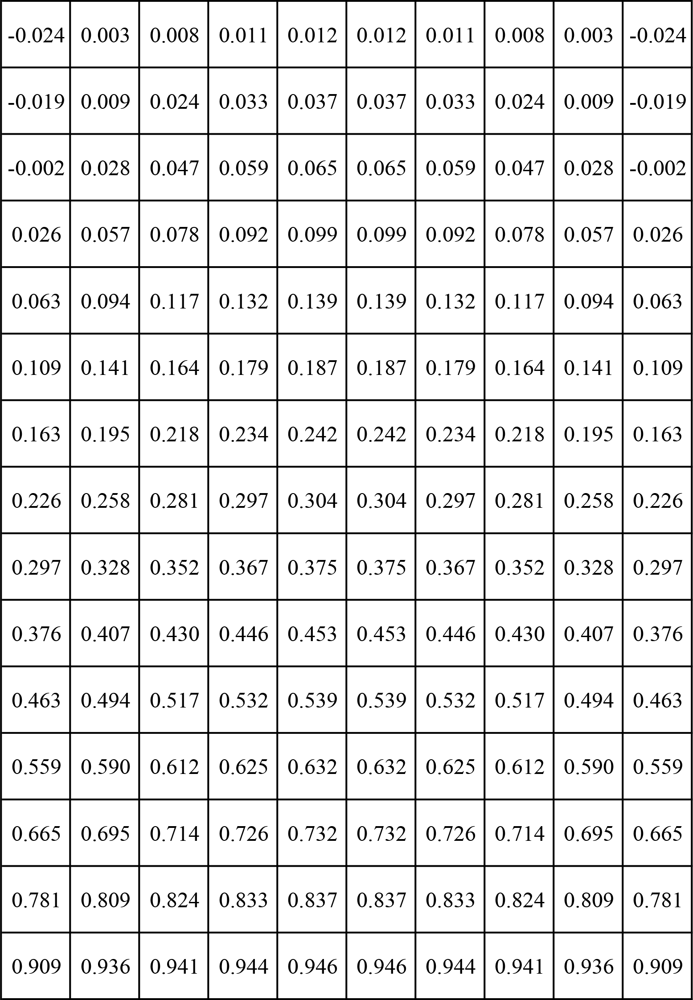
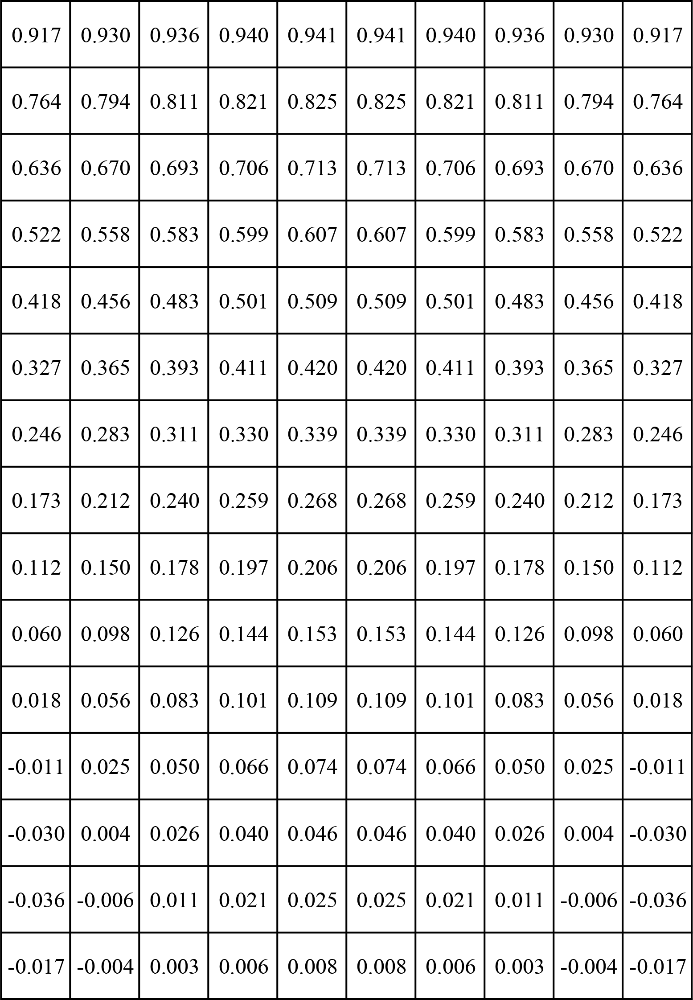

# Two-dimensional Unsteady Heat Conduction

This repository gives Fortran 90 codes to solve two-dimensional unsteady heat conduction problem:

- Numerical solutions which are programed in both **explicit** and **implicit** discrete method are included.
- **Analytical** solution to this problem (Laplace equation) is given to verify the numerical solutions.
- All equations are derived by **[Wolfram Mathematica 11](https://www.wolfram.com/mathematica/)**.

## Contents

- [Problem Definition](#problem-definition)
- [Dimensionless Laplace Equation](#dimensionless-laplace-equation)
- [Numerical Solution](#numerical-solution)
    + [Explicit Method](#explicit-method)
    + [Implicit Method](#implicit-method)
        - [Jacobi Iteration](#jacobi-iteration)
        - [Gauss-Seidel Iteration](#gauss-seidel-iteration)
        - [Jacobi Iteration (Block) + TDMA Algorithm](#jacobi-iteration-block--tdma-algorithm)
        - [Gauss-Seidel Iteration (Block) + TDMA Algorithm](#gauss-seidel-iteration-block--tdma-algorithm)
- [Analytical Solution](#analytical-solution)
- [Reference](#reference)
- [License](#license)

## Problem Definition

</img>

The governing equation of the two-dimensional unsteady heat conduction problem defined in a rectangle region is

and the boundary conditions are

Where, ,  and  are respectively the density, the specific heat capacity and the thermal conductivity. 

## Dimensionless Laplace Equation 

Define , , , , , thus the terms of the Laplace equation can be transformed into

Then a dimensionless governing equation can be derived:

and the dimensionless boundary conditions are

where  and .

## Numerical Solution

Physical parameters listed below will be used in following simulations and analyses.

Besides, the number of meshes in  and  direction are respectively chosen as

You can change the values of all these variables in `params.f90`.

### Explicit Method

Integral numerical formulation can be written in explicit format:

Assumed that  and , the formulation above can be simplified as

where , , , .  and  are respectively number of mesh nodes. 

Boundary conditions:

- **South**: when , , 

- **North**: when , 

- **West**: when , , 

- **East**: when , , 

- **Southwest**: when , , 

- **Northwest**: when , , 

- **Southeast**: when , , 

- **Northeast**: when , , 

>  Note: the explicit method is available only if the diffusion number . 

<!-- 

Non-dimensional temperature on each nodes as well as the contour is shown here. Compared with the analytical solution, the average value and the standard deviation of the relative error are respectively  and .

  </img>
  &nbsp;&nbsp;&nbsp;&nbsp;&nbsp;&nbsp;&nbsp;&nbsp;
  </img>

  
-->

### Implicit Method

Integral numerical formulation can be written in implicit format:

Assumed that  and , the formulation above can be simplified as

where , .

Boundary conditions:

- **South**: when , , 

- **North**: when , 

- **West**: when , , 

- **East**: when , , 

- **Southwest**: when , , 

- **Northwest**: when , , 

- **Southeast**: when , , 

- **Northeast**: when , , 

Therefore,  equations form a system of linear equations, which can also be represented in matrix

where  is a -by- square matrix,  and  are -by- vectors. .

The task to be done, is to solve this system of linear equations. Different iterative methods are supported.

#### Jacobi Iteration

Square matrix  can be decomposed into a diagonal component , and the remainder : 

where,

The solution is then obtained iteratively via 

where  is the -th approximation or iteration of vector . Thus the element-based formula is 

#### Gauss-Seidel Iteration

Square matrix  can be decomposed into its lower triangular component , and its strictly upper triangular component :

where,

The solution is then obtained iteratively via 

Thus the element-based formula is 

#### Jacobi Iteration (Block) + TDMA Algorithm

The methods of the previous sections are also referred to as *point* or *line* iterative methods, since they act on single entries of matrix . It is possible to devise block versions of the algorithms, provided that square matrix  is divided to -by- diagonal blocks of matrix, while vector  is divided to -by- blocks of vector:

The solution is then obtained iteratively via 

Where, subscript  is no longer the index of points, but the index of blocks.

In addition, TDMA algorithm introduces a method to directly solve *tridiagonal* systems of equations, which can be combined with block Jocobi iteration method to reduce the time consumption of iterative process. 

- When subscript  loops from  to , the -by- vector  can be solved directly by TDMA algorithm:

&nbsp;&nbsp;&nbsp;&nbsp;&nbsp;&nbsp; Note that  in this equation.

- When subscript  loops from  to , the -by- vector  can be solved directly by TDMA algorithm:

&nbsp;&nbsp;&nbsp;&nbsp;&nbsp;&nbsp; Note that  in this equation.

#### Gauss-Seidel Iteration (Block) + TDMA Algorithm

Soon...

## Analytical Solution

Analytical solution is given by **[Wolfram Mathematica 11](https://www.wolfram.com/mathematica/)**:

<!--
Non-dimensional temperature on each nodes as well as the contour is shown here. Relative codes can be referred to `analytic.f90`. 

  </img>
  &nbsp;&nbsp;&nbsp;&nbsp;&nbsp;&nbsp;&nbsp;&nbsp;
  </img>

-->

## Reference

- 吴清松. 计算热物理引论[M]. 合肥: 中国科学技术大学出版社, 2009.
- Saad Y. Iterative methods for sparse linear systems[M]. SIAM, 2003.
- Moukalled, F., Mangani, L., Darwish, M. The Finite Volume Method in Computational Fluid Dynamics: an Advanced Introduction with Openfoam® and Matlab®[M]. Springer, 2016.
- Peaceman D W, Rachford H H. The numerical solution of parabolic and elliptic differential equations[J]. Journal of the Society for industrial and Applied Mathematics, 1955, 3: 28-41.
- 吴崇试. 数学物理方法[M]. 北京: 北京大学出版社, 2003.
- 顾樵. 数学物理方法[M]. 北京: 科学出版社, 2015.

## License

[MIT](LICENSE) © Hawk Shaw, University of Science and Technology of China.