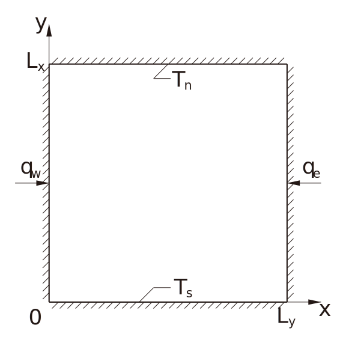

# Two-dimensional Unsteady Heat Conduction

-brightgreen.svg)

This repository gives Fortran 90 codes to solve two-dimensional unsteady heat conduction problem:

- Numeric solutions which are programed in both **explicit** and **implicit** discrete method are included.
- Analytic solution to this problem (Laplace equation) is derived, through separate variable method.

## Contents

- [Problem Definition](#problem-definition)
- [Dimensionless Laplace Equation](#dimensionless-laplace-equation)
- [Numerical Solution](#numerical-solution)
    + [Explicit Method](#explicit-method)
    + [Implicit Method](#implicit-method)
        - [Jacobi Iteration (Point)](#jacobi-iteration-point)
        - [Jacobi Iteration (Line)](#jacobi-iteration-line)
        - [Gauss-Seidel Iteration (Point)](#gauss-seidel-iteration-point)
        - [Gauss-Seidel Iteration (Line)](#gauss-seidel-iteration-line)
- [Analytical Solution](#analytical-solution)
- [Reference](#reference)
- [License](#license)

## Problem Definition

</img>

The governing equation of the two-dimensional unsteady heat conduction problem defined in a square region is

and the boundary conditions are

Where, ,  and  are respectively the density, the specific heat capacity and the thermal conductivity. 

## Dimensionless Laplace Equation 

Define , , , thus the terms of the Laplace equation can be transformed into

Then a dimensionless governing equation can be derived:

and the dimensionless boundary conditions are

## Numerical Solution

Physical parameters listed below will be used in  following simulations and analyses.

### Explicit Method

Soon...

  </img>
  &nbsp;&nbsp;&nbsp;&nbsp;&nbsp;&nbsp;&nbsp;&nbsp;
  </img>

### Implicit Method

Soon...

#### Jacobi Iteration (Point)

Soon...

#### Jacobi Iteration (Line)

Soon...

#### Gauss-Seidel Iteration (Point)

Soon...

#### Gauss-Seidel Iteration (Line)

Soon...

## Analytical Solution

Soon...

  </img>
  &nbsp;&nbsp;&nbsp;&nbsp;&nbsp;&nbsp;&nbsp;&nbsp;
  </img>

## Reference

- 吴清松. 计算热物理引论[M]. 合肥: 中国科学技术大学出版社, 2009.
- Peaceman D W, Rachford H H. The numerical solution of parabolic and elliptic differential equations[J]. Journal of the Society for industrial and Applied Mathematics, 1955, 3: 28-41.
- 吴崇试. 数学物理方法[M]. 北京: 北京大学出版社, 2003.
- 顾樵. 数学物理方法[M]. 北京: 科学出版社, 2015.

## License

[MIT](LICENSE) © Hawk Shaw, University of Science and Technology of China.